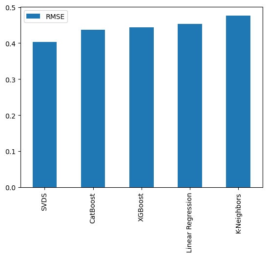

# Результаты экспериментов с использованием различных алгоритмов для определения того, понравится пользователю фильм/книга/трек или нет

[Ноутбук с кодом моделей](./MoodStream_Experiments.ipynb)

## Метрика и модели
Сначала я пытался решить задачу регрессии и использовал метрику RMSE, которую выбрал из-за достаточно прозрачной и простой формулы, которую относительно легко объяснить: 
```
RMSE = sqrt(1/n * sum((y_pred - y_true)^2))
```
где `y_pred` - предсказанные значения, `y_true` - фактические значения, `n` - количество примеров.
Таким образом я измерял отклонение между предсказанными оценками и фактическими.


Однако позже стало ясно, что это, скорее, задача классификации, т.к. мне требуется предсказывать рейтинг, имеющий всего два значения - True и False. Т.е. лайк или дизлайк. Поэтому я провёл новый набор экспериментов и результаты стали лучше. Метрика - Accuracy. True и False в отзывах относительно сбалансированы - примерно в пропорциях 60/40, так что она вполне подходит.

Тестирование и работу с датасетами осуществляю с помощью [ClearML](https://clear.ml)

Протестированные алгоритмы/модели:
- Коллаборативная фильтрация на основе матричной факторизации (SVDS)
- Метод k-ближайших соседей
- Линейная регрессия
- XGBoost
- CatBoost

---

## Информация о датасетах

### Фильмы
- 750 записей с информацией о фильмах
- 8606070 записей об оценках фильмов
- 258768 пользователей, оставивших оценку

### Книги
- 7473 записей с информацией о книгах
- 102558 записей об оценках книг
- 25468 пользователей, оставивших оценку

### Треки
- 127880 записей с информацией о треках
- 964164 записей об оценках треков
- 6694 пользователей, оставивших оценку

---

## SVDS

Изначально я допустил ошибку в подготовке матрицы и заполнил отсутствующие значения нулями, это фактически означало то, что пользователю элемент не понравился и получил негативную оценку, а не отсутствие оценки вовсе.
Результаты вышли отличные.

/ | Фильмы | Книги | Треки
--- | --- | --- | ---
RMSE | 0.36 | 0.29 | 0.29
Время с. | 103 | 15 | 125


После корректировки ситуация изменилась

/ | Фильмы | Книги | Треки
--- | --- | --- | ---
RMSE | 0.39 | 0.45 | 0.37
Время с. | 125 | 30 | 163


---

## Метод k-ближайших соседей

### С гиперпараметрами по умолчанию
**KNeighborsRegressor**
/ | Фильмы | Книги | Треки
--- | --- | --- | ---
RMSE | 0.44 | 0.50 | 0.49
Время с. | 25 | 6 | 8

**KNeighborsClassifier**

/ | Фильмы | Книги | Треки
--- | --- | --- | ---
Accuracy | 0.75 | 0.64 | 0.65
Время с. | 63 | 7 | 11

### С подбором гиперпараметров
**KNeighborsRegressor**

Наилучшие параметры, полученные с помощью `GridSearchCV`
```
{'n_neighbors': 7, 'p': 1, 'weights': 'uniform'}
```
/ | Фильмы | Книги | Треки
--- | --- | --- | ---
RMSE | 0.43 | 0.48 | 0.47
Время с. | 33 | 6 | 6

**KNeighborsClassifier**

Наилучшие параметры, полученные с помощью `GridSearchCV`
```
{'algorithm': 'auto', 'n_neighbors': 9, 'weights': 'uniform'}
```
/ | Фильмы | Книги | Треки
--- | --- | --- | ---
Accuracy | 0.76 | 0.66 | 0.65
Время с. | 69 | 7 | 17

---

## Линейная регрессия

/ | Фильмы | Книги | Треки
--- | --- | --- | ---
RMSE | 0.41 | 0.46 | 0.49
Время с. | 10 | 7 | 6

---

## XGBoost

### С гиперпараметрами по умолчанию
**XGBRegressor**:
/ | Фильмы | Книги | Треки
--- | --- | --- | ---
RMSE | 0.41 | 0.46 | 0.46
Время с. | 52 | 6 | 9

**XGBClassifier**:
/ | Фильмы | Книги | Треки
--- | --- | --- | ---
Accuracy | 0.78 | 0.70 | 0.72
Время с. | 52 | 7 | 14


### С подбором гиперпараметров
Наилучшие параметры, полученные с помощью `GridSearchCV`

**XGBRegressor**:
```
{'gamma': 0, 'learning_rate': 0.1, 'max_depth': 5, 'n_estimators': 1000, 'reg_alpha': 1, 'reg_lambda': 1}
```
/ | Фильмы | Книги | Треки
--- | --- | --- | ---
RMSE | 0.41 | 0.44 | 0.42
Время с. | 142 | 15 | 79

**XGBClassifier**:
```
{'learning_rate': 0.1, 'max_depth': 5, 'n_estimators': 100}
```
/ | Фильмы | Книги | Треки
--- | --- | --- | ---
Accuracy | 0.78 | 0.70 | 0.69
Время с. | 49 | 7 | 13

---

## CatBoost

### С гиперпараметрами по умолчанию
**CatBoostRegressor**:
/ | Фильмы | Книги | Треки
--- | --- | --- | ---
RMSE | 0.41 | 0.46 | 0.44
Время с. | 146 | 10 | 24

**CatBoostClassifier**:
/ | Фильмы | Книги | Треки
--- | --- | --- | ---
Accuracy | 0.78 | 0.69 | 0.70
Время с. | 314 | 12 | 36


### С подбором гиперпараметров
Наилучшие параметры, полученные с помощью `GridSearchCV`

**CatBoostRegressor**:
```
{'depth': 3, 'iterations': 3000, 'learning_rate': 0.07}
```
/ | Фильмы | Книги | Треки
--- | --- | --- | ---
RMSE | 0.41 | 0.46 | 0.44
Время с. | 342 | 17 | 49

| Изменение гиперпараметров не повлияло на результаты, а время обучения модели сильно увеличилось.

**CatBoostClassifier**:
```
{'depth': 4, 'iterations': 500, 'learning_rate': 0.1}
```
/ | Фильмы | Книги | Треки
--- | --- | --- | ---
Accuracy | 0.78 | 0.69 | 0.68
Время с. | 97 | 8 | 18

| Время на обучение уменьшилось, но результаты стали хуже.

---

## Решение задачи регрессии

### С гиперпараметрами по умолчанию
Изучив RMSE для разных датасетов с оценками (фильмы, книги и треки), я делаю вывод, что коллаборативная фильтрация на основе матричной факторизации (SVDS) точнее определяет, понравится элемент пользователю или нет. За ним следуют CatBoost и XGBoost.



### С подбором гиперпараметров
Коллаборативная фильтрация на основе матричной факторизации (SVDS) всё так же выдаёт более точный результат, а для XGBoost удалось подобрать такие гиперпараметры, которые позволили обойти CatBoost.


---

В результате экспериментов с гиперпараметрами не удалось добиться ощутимого улучшения результатов.

## Решение задачи классификации

### С гиперпараметрами по умолчанию
Изучив Accuracy для разных датасетов с оценками (фильмы, книги и треки), я делаю вывод, что XGBClassifier, понравится элемент пользователю или нет. За ним следуют CatBoostClassifier и KNeighborsClassifier.


### С подбором гиперпараметров
XGBClassifier всё так же выдаёт более точный результат, а для KNeighborsClassifier удалось подобрать такие гиперпараметры, которые улучшили качество модели.


---

В результате экспериментов с гиперпараметрами не удалось добиться ощутимого улучшения результатов.
Но в дальнейшем будет добавлена фильтрация по жанрам для повышения релевантности выдачи.

В качестве модели я буду использовать XGBClassifier - лучшие показатели точности и скорости обучения модели.


