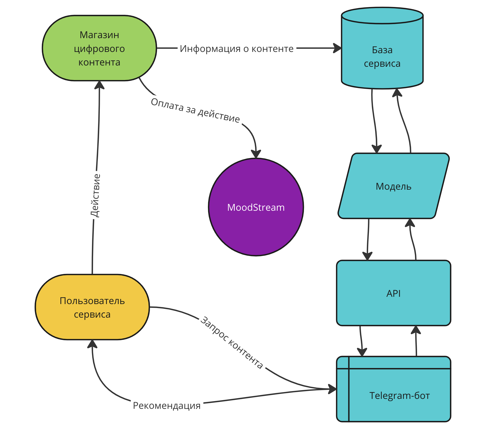

# MoodStream

[My First Data Project 2: от идеи к продукту](https://ods.ai/tracks/mfdp2)

---

Репозиторий содержит данные, необходимые для участия в конкурсе:
- [Ноутбук с описанием проекта и baseline](./MoodStream.ipynb)
- [Ноутбук с описанием хода подготовительных работ](./MoodStream_PREP.ipynb)
- [Ноутбук с экспериментами](./MoodStream_Experiments.ipynb)

Датасеты перемещены в ClearML

---

## Описание сервиса

Сервис по подбору музыки, фильмов и книг исходя из предпочтений и свободного времени.

---

Укажи свои предпочтения, выбери настроение и MoodStream поможет тебе подобрать идеальный контент. Больше никаких поисков по музыкальным сервисам или бесцельных просмотров фильмов. Теперь все твои любимые треки, фильмы и книги приспосабливаются к твоим пожеланиям! 

## Бизнес-модель

Сервис является маркетплейсом цифрового контента: книг, фильмов и музыки.
 
Наши клиенты предоставляют выгрузку с информацией о своих цифровых товарах, а мы, на основании предпочтений наших пользователей, отображаем их в выдаче.
 
Оплата от клиентов-магазинов происходит за выполнение пользователем какого-либо действия: переход по ссылке, регистрация в магазине, оформление подписки.
 
Для конечных пользователей сервис бесплатен.

Таким образом оценивать изменение эффективности ML-модели можно с помощью анализа соотношения пользователей сервиса к совершаемым ими действиям, несущим прибыль сервису. Если количество действий на пользователя растёт, то и ML-модель работает хорошо, т.к её рекомендации подходят пользователю.

## Задача и метрики

Разработать модель машинного обучения, которая будет рекомендовать пользователю фильмы, сериалы, книги или музыку на основе его предпочтений и настроения. Модель должна учитывать данные о схожести между контентом и предпочтениями пользователя, чтобы предложить наиболее подходящий контент.

На основании [проведённых экспериментов](./EXPERIMENTS.md) проводится решение задачи классификации и качество модели изменяется с помощью метрики accuracy, т.к. классы в исходных данных достаточно сбалансированны - примерно 60/40.

Accuracy - это доля правильно предсказанных классов от общего числа классов, и она показывает, насколько точно модель предсказывает классы.

